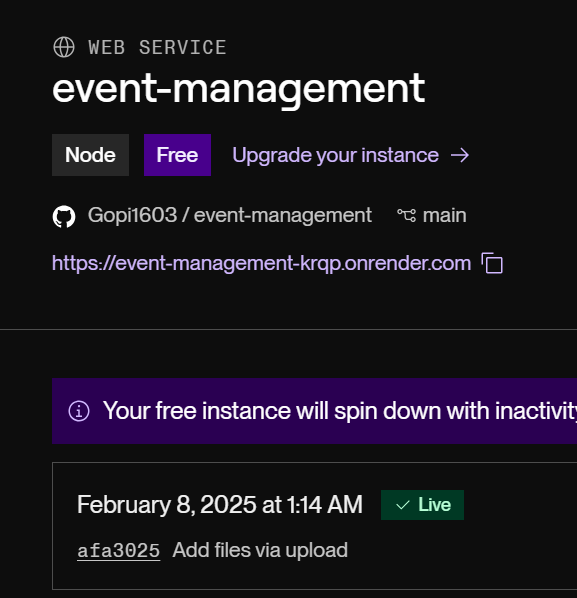
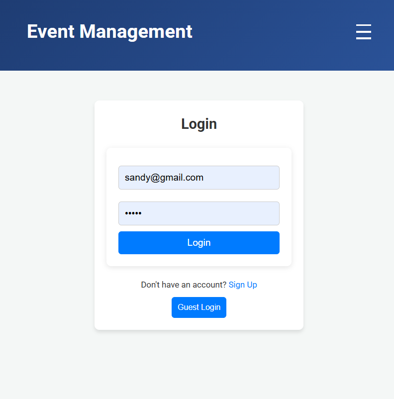

# 🎉 Event Management Platform

## 🚀 Overview

This is a **full-stack** event management platform where users can **create, manage, and view events**. The platform includes:

✅ **User Authentication** (JWT-based) 🔐  
✅ **Event Creation & Management** 📅  
✅ **Real-time Updates** using **Socket.IO** ⚡  
✅ **Deployed using Free-Tier Services**:
   - **Frontend:** Vercel
   - **Backend:** Render
   - **Database:** MongoDB Atlas (Free Tier)
   - **Image Hosting:** Cloudinary (Free Tier)

---

## 🎯 Objective

🔹 **User Authentication:** Register/Login & Guest Mode for limited features.  
🔹 **Event Dashboard:** List of upcoming & past events with filters.  
🔹 **Event Creation:** Form for adding event details like name, description, date, etc.  
🔹 **Real-Time Updates:** Attendee count updates live using **Socket.IO**.  
🔹 **Responsive Design:** Works across all devices with modern UI effects.  

---

## ✨ Features

### 🖥️ Frontend
- **🔑 Authentication:** Registration, Login, & Guest Login.  
- **📌 Event Dashboard:** List & filter events (All, Upcoming, Past).  
- **📝 Event Creation:** Add new events with details.  
- **⚡ Real-Time Updates:** Uses **Socket.IO** for attendee count.  
- **🎨 Modern UI:** Gradient backgrounds, **glassmorphism**, and animations.  

### 🔧 Backend
- **🛡️ Authentication API:** Secure **JWT-based authentication**.  
- **📊 Event Management API:** CRUD operations with ownership restrictions.  
- **⚡ Real-Time Updates:** Integrated with **Socket.IO**.  
- **🗄️ Database:** **MongoDB Atlas** for event/user data storage.  
- **🚀 Deployment:** Hosted on **Render (Free Tier)**.  

---

## 🧪 Sample Credentials for Testing
- **Email:** `sandy@gmail.com`  
- **Password:** `sandy`  
---
## 🌍 Deployment

### 🎯 Live URLs
- **Frontend:** [Event Management App](https://event-management-beige.vercel.app/)  
- **Backend:** [API Server](https://event-management-krqp.onrender.com)  

---

### 📸 Deployment Screenshots
- _database-monodb-atlas.png)  
  *MongoDB Atlas Dashboard (Free Tier)*
-   
  *Backend Deployment on Render*
-   
  *Frontend Deployment on Vercel*

  
---
  
## 🛠️ Installation & Setup

### 📌 Frontend Setup
1️⃣ Navigate to the frontend folder:  
   ```sh
   cd frontend
   ```
2️⃣ Install dependencies:  
   ```sh
   npm install
   ```
3️⃣ Configure Environment Variables:  
   Create a `.env` file inside the frontend directory:
   ```sh
   REACT_APP_API_URL=http://localhost:5000
   ```
   _(Note: Replace with your deployed backend URL in production)_
4️⃣ Run the frontend development server:  
   ```sh
   npm start
   ```
   📌 Opens at: **http://localhost:3000**

---

### 📌 Backend Setup
1️⃣ Navigate to the frontend folder:  
   ```sh
   cd backend
   ```
2️⃣ Install dependencies:  
   ```sh
   npm i
   ```
3️⃣ Configure Environment Variables:  
   replace links to localhost in the backend files and include your monodb credentials(.env) to test or use my deployed version:
   ```sh
   =http://localhost:5000
   ```
   _(Note: Replace with my deployed backend URL with localhost:5000 for testing)_
4️⃣ Run the frontend development server:  
   ```sh
   nodemon server.js
   ```
   📌 Opens at: **http://localhost:5000**

---

<sub><sup>✨ Built with passion and creativity by [Gopi Chakradhar](https://gopi-chakradhar.vercel.app/) ✨</sup></sub>
